<div align="center">

# VedaAI — AI Assessment Creator

**A full-stack SaaS for teachers to generate, grade, and manage AI-powered question papers.**

Built end-to-end against the [VedaAI hiring assignment brief](#-assignment-brief--what-i-built-vs-what-was-asked) — every required item, every brief bonus, plus 20+ extras that demonstrate production-grade thinking.

[Demo Video](#demo-video) · [Screenshots](#screenshots) · [Architecture](#-architecture) · [Local Setup](#-local-setup) · [Deployment](#-deployment) · [API Reference](#-api-reference)

</div>

---

## 🌐 Live demo

**App:** https://veda-ai-assessment-nine.vercel.app

**API:** https://vedaai-api-imf5.onrender.com/api/health

Sign up with any email — the demo flow takes ~30 seconds from blank account to generated paper.

> 🎥 **Loom walkthrough:** *(add link after recording)*

## Screenshots

A few highlights from the live app. All screenshots are in [`docs/screenshots/`](./docs/screenshots).

| Sign in | Create assignment |
|---|---|
| 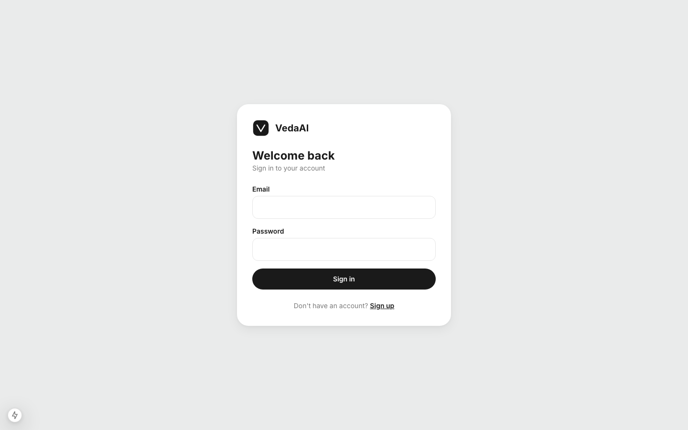 | 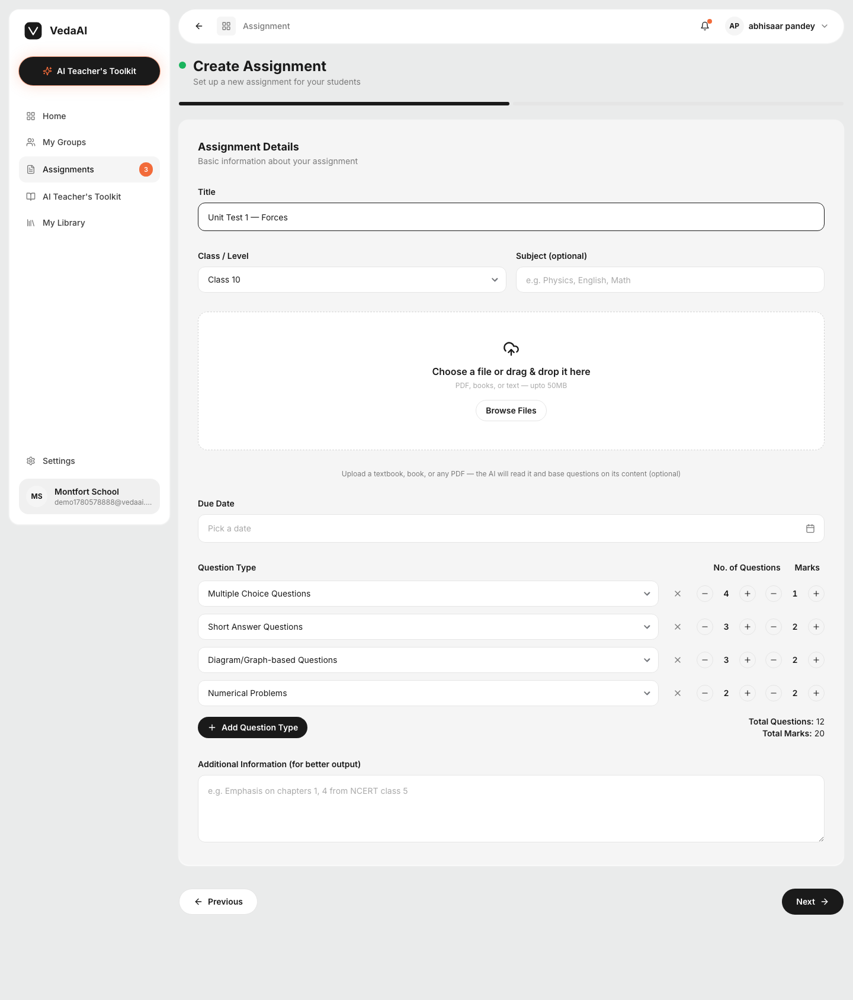 |

| Generated paper (with detailed answer key) | Settings |
|---|---|
| 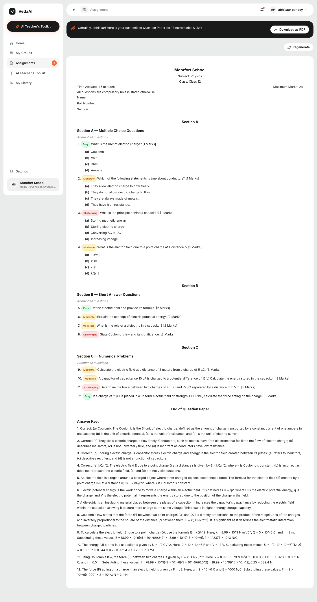 | 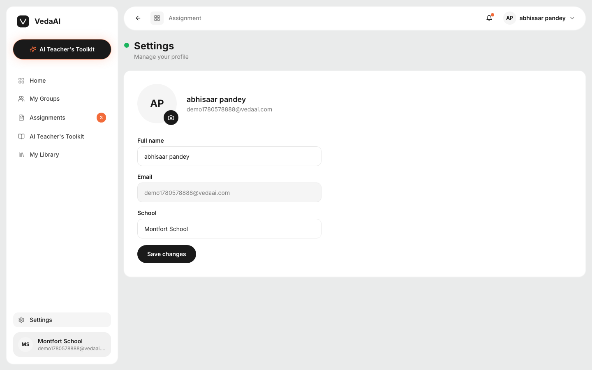 |

| AI Teacher's Toolkit | My Groups |
|---|---|
| 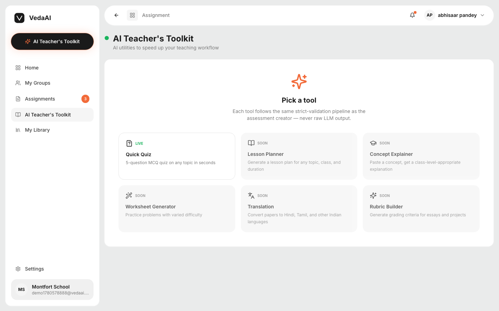 | 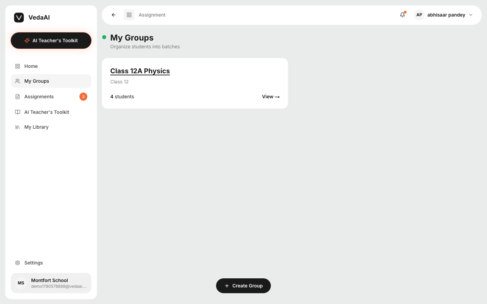 |

| My Library | Quick Quiz |
|---|---|
| 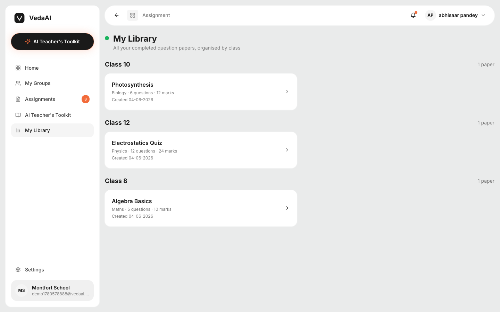 | 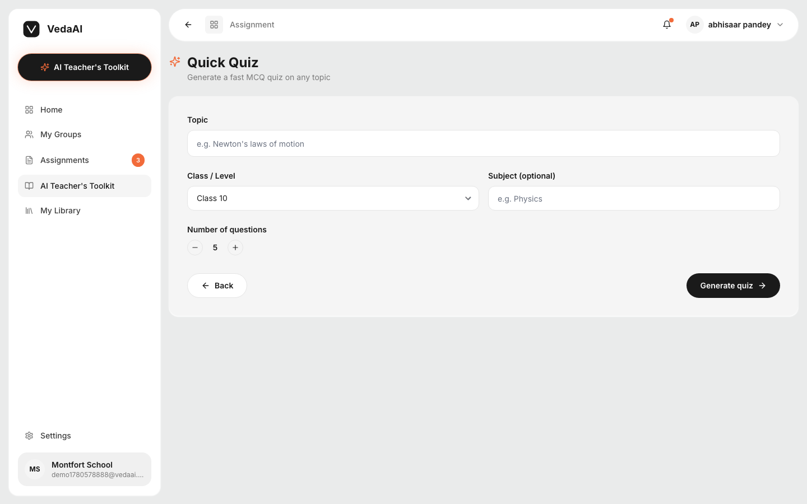 |

**Mobile responsive** (393–414px):

| Assignments list | Create form (stacked rows) | Paper output |
|---|---|---|
| 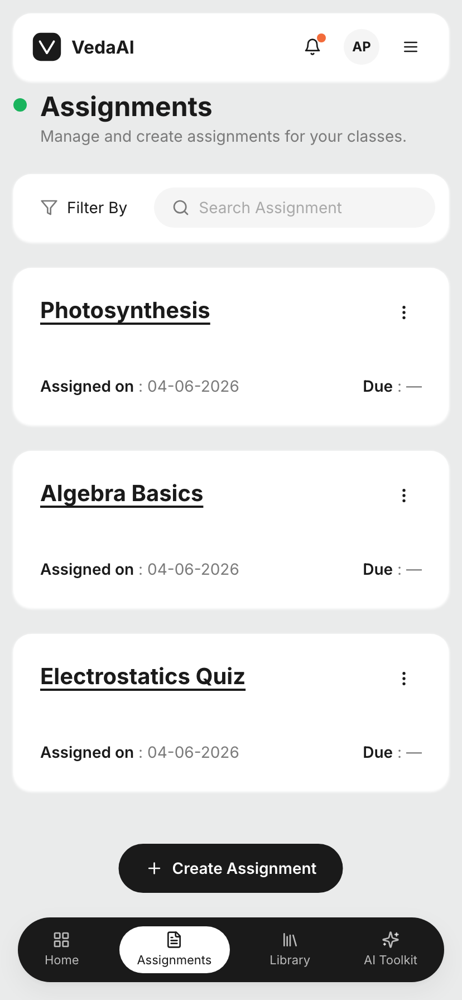 | 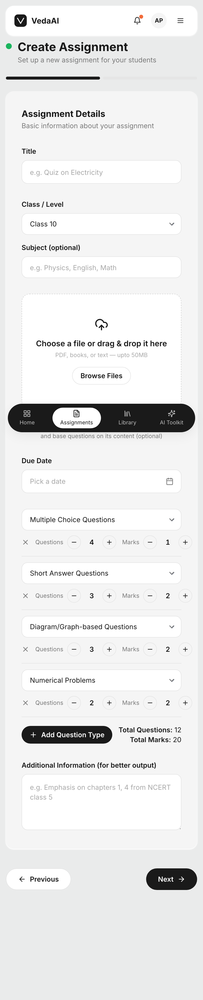 | 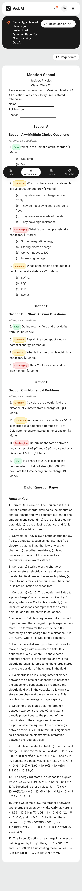 |

---

## 🚀 What this is

VedaAI lets a teacher:

1. **Sign in** (email/password, JWT-secured)
2. **Upload a textbook PDF** or just describe what they want
3. **Choose class level, subject, exact question type breakdown** (e.g. "4 MCQ × 1 mark, 3 Short × 2 marks, 4 Numerical × 5 marks")
4. **Watch a real-time progress bar** as the AI generates the paper
5. **Get a printable question paper** with sections, color-coded difficulty pills, MCQ options, and a detailed teacher's answer key
6. **Download as PDF**, **regenerate**, organise students into **groups**, browse a **library** of past papers, and use the **AI Teacher's Toolkit**

The whole pipeline is built the way you'd build it in production — separate worker process, Redis pub/sub bus, strict-JSON AI calls with Zod validation, retry-with-error-injection, deterministic post-processing, per-user data scoping, rate-limited auth, integration tests, CI.

---

## 🏗 Architecture

### Process model

```
┌─────────────────────────────────────────────────────────────────────────┐
│                                                                         │
│  ┌────────────────┐  POST /api/assignments     ┌────────────────┐       │
│  │ Next.js client │ ─────────────────────────▶ │ Express API    │       │
│  │ (Vercel)       │                            │ (Render Web)   │       │
│  │                │ ◀── 201 (status: pending)  │                │       │
│  └────────┬───────┘                            └────────┬───────┘       │
│           │                                             │               │
│           │      Socket.IO room=<assignmentId>    ┌─────▼──────────┐    │
│           │ ◀────────────────────────────────────▶│ Redis pub/sub  │    │
│           │                                       │  BullMQ queue  │    │
│           │                                       └─────▲──────────┘    │
│           │                                             │               │
│           │                                  ┌──────────┴────────┐      │
│           │                                  │ Worker process    │      │
│           │                                  │ (Render Worker)   │      │
│           │                                  │                   │      │
│           │                                  │ 1. cache check    │      │
│           │                                  │ 2. OpenAI call    │      │
│           │                                  │ 3. JSON.parse     │      │
│           │                                  │ 4. Zod validate   │      │
│           │                                  │ 5. retry on bad   │      │
│           │                                  │ 6. reconcile      │      │
│           │                                  │ 7. save + emit    │      │
│           │                                  └────┬──────────────┘      │
│           │                                       │                     │
│           │                              ┌────────▼─────────┐           │
│           │                              │ MongoDB Atlas    │           │
│           │                              │ Users +          │           │
│           │                              │ Assignments +    │           │
│           │                              │ QuestionPapers + │           │
│           │                              │ Groups           │           │
│           │                              └──────────────────┘           │
│           ▼                                                             │
│  GET /api/assignments/:id  ← (fallback if a socket event is missed)     │
│                                                                         │
└─────────────────────────────────────────────────────────────────────────┘
```

### Why two processes?

The API (`server/src/index.ts`) and the worker (`server/src/worker.ts`) **boot independently**, share a Redis instance, and communicate via a Redis pub/sub bus (channel `veda:job-events`). The worker publishes status/progress/completion events; the API re-emits them to the right Socket.IO room (`assignmentId`).

This means:
- You can scale the API horizontally for traffic spikes without touching the worker
- You can scale workers independently for AI throughput
- A long-running OpenAI call never blocks the request thread
- Failures in one process don't take down the other

This mirrors a real production deploy. The `render.yaml` blueprint provisions both as separate Render services from the same Docker image.

### The "never render raw AI output" pipeline

This was the highest-weight rule in the brief and the heart of the architecture:

```
OpenAI response (string)
        │
        ▼
JSON.parse  (inside try/catch — parse failure does not crash the worker)
        │
        ▼
PaperSchema.safeParse  (Zod — enforces shape, types, enums)
        │
        ▼
validatePaperAgainstAssignment  (semantic — marks within tolerance, count within tolerance)
        │
        ▼  (if any check fails)
RETRY ONCE  with the validation error injected as a correction message
        │
        ▼
assignStableIds  (ids backfilled if AI omitted them)
        │
        ▼
applyMarksFromBreakdown  (deterministic — set marks per question from the form's exact spec)
        │
        ▼
reconcilePaper  (proportional rescale so totals are exact, only if no breakdown was provided)
        │
        ▼
GeneratedPaper (typed)  →  MongoDB  +  Socket.IO emit  +  Redis cache
```

The result: **even if the model returns malformed JSON, slightly off marks, or wrong counts, the user gets a correct paper.** Raw model text is never written to MongoDB and never sent to the client.

---

## ✨ Features

### Required by the brief (✅ all done)

- ✅ **Assignment Creation form** — file upload (PDF/text), due date (real calendar picker), question types (multi-row table), questions + marks (per-type steppers), additional instructions, **class/level** dropdown (Class 1–12, JEE Main, JEE Advanced, NEET, General), **subject** field
- ✅ **Validation** — Zustand `validate()` client-side mirrors Zod 400 errors server-side
- ✅ **Zustand state** — `useAssignmentStore` with form state + submit
- ✅ **Socket.IO** — real-time progress, room-scoped to `assignmentId`
- ✅ **AI Question Generation** — structured prompt → `response_format: { type: "json_object" }` → Zod-validated
- ✅ **Never render raw LLM output** — strict Zod gate before storage or emission
- ✅ **Backend stack** — Node + Express + TypeScript + Mongoose + ioredis + BullMQ + Socket.IO + Zod
- ✅ **Flow** — API → queue → worker → store → notify (separate worker process)
- ✅ **Output page** — student info (Name / Roll / Section), sections with title + instruction, questions with text + color-coded difficulty pill + marks
- ✅ **Mobile responsive** — sidebar collapses, bottom tab bar, hamburger drawer, stacked form rows

### Brief bonuses (✅ all done)

- ✅ **Download as PDF** — real PDF via `jsPDF` with inline colored difficulty labels and Answer Key (React 19-compatible; replaced `@react-pdf/renderer` after a compat bug)
- ✅ **Regenerate** — action button on the output page re-runs generation with same inputs
- ✅ **Difficulty as visual badges** — green/amber/red rounded pills (`Easy` / `Moderate` / `Challenging`)
- ✅ **Better caching** — sha256 of normalized inputs → Redis `paper:cache:<hash>` → cache hits skip OpenAI entirely; user sees "Loaded from cache" label live
- ✅ **Improved UI polish** — custom design system from the supplied Figma; pill-style badges; sticky sidebar; functional bell notifications popover

### Extras beyond the brief (22+ items)

| Category | What |
|---|---|
| **Auth** | JWT signup/login/me, NextAuth credentials provider, JWT secret enforced ≥32 chars by Zod |
| **Per-user scoping** | `userId` on Assignment + Group, ownership checks on every protected route, `attachAuth` vs `requireAuth` separation |
| **Settings page** | Editable display name + school + email (read-only), profile picture upload via `multer` |
| **Profile pic everywhere** | Fresh `/api/auth/me` fetch on every server-component render → topbar avatar, sidebar school card, mobile header all show live user data |
| **Real PDF/text source upload** | `pdf-parse` extracts up to 120k chars from textbooks; biases the AI prompt |
| **Retry on bad AI output** | When parse or Zod validation fails, retry once with the validation error injected as a correction prompt |
| **Auto-rescale marks** | `reconcilePaper()` proportionally rescales question marks to hit exact requested total when no breakdown is given |
| **Deterministic breakdown enforcement** | When `questionBreakdown` is provided (per-type counts + marks), `applyMarksFromBreakdown()` sets marks per question deterministically — the AI cannot drift |
| **Varied difficulty distribution** | Prompt explicitly requires ~30% easy / 40% medium / 30% hard within every section |
| **Detailed teacher's answer key** | Prompt requires 3–8 sentences per answer with working/derivation/concepts; MCQ answers explain why the correct option is correct AND why a tempting wrong option is wrong |
| **MCQ options end-to-end** | Schema + Mongoose + types + UI + PDF all carry `options: string[]`; rendered as `(a)`/`(b)`/`(c)`/`(d)` under each MCQ question |
| **Cross-process event bus** | Redis pub/sub bridges the standalone Worker to the API's Socket.IO rooms (channel `veda:job-events`) |
| **Cache hit label visible** | "Loaded from cache" appears in the live progress overlay when the cached answer is reused |
| **Live filter + search** | Status filter (All / Completed / Processing / Pending / Failed), level filter (Class 1–12 / JEE / NEET / General), free-text title search — all client-side, all instant |
| **Functional bell notifications** | Popover shows last 8 assignments with their status, time-ago, click to navigate; dot indicator when items are processing/failed |
| **Groups CRUD** | Group model + `GET/POST/GET:id/PATCH:id/DELETE:id` endpoints; list + create + view pages; per-user scoped |
| **AI Teacher's Toolkit** | Landing page with 6 tools; **Quick Quiz** is live (reuses the assessment pipeline with preset MCQ × 2 marks) |
| **My Library** | Completed papers grouped by class level |
| **Real calendar date picker** | `react-day-picker` v9 popover replacing the native `<input type="date">` |
| **Rate limiting** | `express-rate-limit` — 10 req / 15 min on `/api/auth/*`, 60 req / min on all `/api` |
| **Graceful API shutdown** | SIGINT/SIGTERM handlers close the HTTP server + disconnect Mongoose |
| **Integration tests + CI** | 5 vitest+supertest tests, GitHub Actions runs typecheck + tests + client build on every push/PR |

---

## 🛠 Tech stack

| Layer | Stack |
|---|---|
| **Client** | Next.js 15 (App Router) · TypeScript (strict) · Tailwind CSS · Zustand · NextAuth v5 · Socket.IO client · jsPDF · react-day-picker · lucide-react |
| **API** | Node 20 · Express 4 · TypeScript · Mongoose 8 · Socket.IO 4 · BullMQ 5 · Zod 3 · bcryptjs · jsonwebtoken · express-rate-limit · multer · pdf-parse |
| **Worker** | Standalone Node entrypoint · BullMQ Worker · OpenAI SDK (`gpt-4o-mini`) |
| **Infra (local)** | docker-compose (Mongo 7 + Redis 7) |
| **Infra (prod)** | Vercel (client) · Render (API + Worker + Redis) · MongoDB Atlas |
| **Testing** | Vitest + supertest + mongodb-memory-server + mocked OpenAI |
| **CI** | GitHub Actions — server typecheck + tests, client typecheck + `next build` |

---

## 📁 Repo layout

```
/docker-compose.yml          Local dev: Mongo + Redis
/render.yaml                 Render Blueprint (API + Worker + Redis)
/.github/workflows/ci.yml    Typecheck + tests on push/PR
/docs/
  /screenshots/              13 PNGs (desktop + mobile)

/server
  Dockerfile                 Multi-stage build for Render
  vitest.config.ts
  tests/
    setup.ts                 In-memory Mongo + OpenAI/BullMQ/Redis stubs
    api.test.ts              5 integration tests
  src/
    config/                  env, mongo, redis, openai client
    models/                  User, Assignment, QuestionPaper, Group
    queues/                  BullMQ generation queue
    workers/                 paperSchema, promptBuilder, generatePaper, paperCache
    routes/                  auth, assignments, user, groups
    middleware/              requireAuth, attachAuth, rateLimit
    sockets/                 Socket.IO + Redis bus
    lib/                     jwt, upload (multer), extractText (pdf-parse)
    app.ts                   Express factory (used by tests + index)
    index.ts                 API process entry
    worker.ts                Worker process entry

/client
  app/
    (app)/                   Protected layout (sidebar + topbar + mobile drawer)
      assignments/           list, new, [id] (paper output)
      groups/                list, new, [id]
      toolkit/               landing + quick-quiz
      library/               archive grouped by class level
      settings/              profile + avatar upload
    auth/                    sign-in, sign-up
    api/auth/[...nextauth]/  NextAuth route handler
  components/
    layout/                  Sidebar, Topbar, MobileShell, AppShell, NotificationsButton
    ui/                      Button, Card, Stepper, ProgressBar, DifficultyText, EmptyState,
                             AssignmentCard, AssignmentsListView, GenerationOverlay,
                             FileDropzone, DateInput (react-day-picker), Select, Textarea,
                             PaperBanner, PaperHeader, QuestionList, AnswerKey,
                             RegenerateButton, DeleteGroupButton
    pdf/                     buildPaperPdf (jsPDF), DownloadPdfButton
    icons/                   VedaLogo, EmptyStateIllustration
    providers/               SessionProvider
  store/                     useAssignmentStore
  lib/                       api, socket, authClient, groupsApi, cn, persona
  auth.ts                    NextAuth v5 config
```

---

## 🧪 Local setup

### Prereqs
- Node.js 20+
- Docker Desktop
- An OpenAI API key

### One-time

```bash
git clone https://github.com/<you>/vedaai.git
cd vedaai

# env files
cp server/.env.example server/.env
cp client/.env.example client/.env.local
# edit server/.env and set OPENAI_API_KEY=sk-...
# JWT_SECRET also needs to be ≥32 chars (auto-validated)

# install
(cd server && npm install)
(cd client && npm install --legacy-peer-deps)
```

### Run

Open 4 terminals:

| Terminal | Working dir | Command | What |
|---|---|---|---|
| 1 | `vedaai/` | `docker compose up` | Mongo + Redis |
| 2 | `vedaai/server/` | `npm run dev` | Express API on :4000 |
| 3 | `vedaai/server/` | `npm run worker` | BullMQ worker (separate process) |
| 4 | `vedaai/client/` | `npm run dev` | Next.js on :3000 |

Visit **http://localhost:3000** → sign up → create assignment → watch live progress → see the paper.

### Tests

```bash
cd server
npm test          # vitest run (5 integration tests)
npm run test:watch
```

### Troubleshooting

| Symptom | Fix |
|---|---|
| Assignment stuck on "pending" | Worker isn't running. Start terminal 3. |
| `ECONNREFUSED :27017` or `:6379` | Docker isn't up. Start terminal 1. |
| `JWT_SECRET must be at least 32 chars` | Set it in `server/.env`. |
| `EADDRINUSE :4000` or `:3000` | A previous dev process is still bound. `pkill -f "tsx watch src/"` and `pkill -f "next dev"`. |

---

## 🚢 Deployment

### Backend → Render (one-click blueprint)

`render.yaml` provisions:
- **vedaai-api** (Docker web service)
- **vedaai-worker** (Docker worker service, same image, overridden CMD)
- **vedaai-redis** (managed Redis, free tier)

Steps:
1. Sign up at [render.com](https://render.com)
2. Create a free MongoDB Atlas cluster → get the connection string
3. In Render: **New → Blueprint** → connect this repo → it auto-reads `render.yaml`
4. Provide secrets:
   - `MONGODB_URI` = your Atlas connection string
   - `OPENAI_API_KEY` = your OpenAI key
   - `CLIENT_ORIGIN` = (fill in after Vercel deploy below)
5. Click **Apply** — Render builds the Docker image from `server/Dockerfile` and runs API + Worker as separate services sharing it. `JWT_SECRET` is auto-generated.

### Client → Vercel

```bash
cd client
npx vercel  # follow prompts; link, deploy to prod
```

Then in Vercel project settings → Environment Variables:

```
NEXT_PUBLIC_API_URL    = https://vedaai-api.onrender.com
NEXT_PUBLIC_SOCKET_URL = https://vedaai-api.onrender.com
NEXTAUTH_URL           = https://<your-vercel-domain>
NEXTAUTH_SECRET        = (run: openssl rand -base64 32)
```

Then back in Render → `vedaai-api` → set `CLIENT_ORIGIN` to your Vercel URL.

---

## 🔐 Auth & security

- **JWT-based** with bcrypt (cost 10) for passwords
- **Backend signs the token**; NextAuth credentials provider calls `/api/auth/login` and stashes the JWT inside the NextAuth session JWT; client fetches send `Authorization: Bearer <token>`
- **Per-resource ownership checks** — every `requireAuth` route verifies `req.user.sub === resource.userId`
- **Rate limiting** — 10 req / 15 min on auth, 60 req / min on the whole `/api` namespace (in-memory store; would use `rate-limit-redis` in multi-instance prod)
- **CORS** — explicit `CLIENT_ORIGIN` allow-list on both Express and Socket.IO
- **JWT secret** — Zod-enforced ≥32 chars
- **File upload** — mimetype filtered (image-only for avatars, PDF/text for source), 5MB / 50MB caps respectively
- **No secrets in code** — verified by `grep -rn "sk-[A-Za-z0-9]" src/` returning nothing
- **`.env` gitignored**, `.env.example` documents all required vars

---

## 📡 API reference

### Auth

| Method | Route | Auth | Body | Returns |
|---|---|---|---|---|
| POST | `/api/auth/signup` | — (rate-limited) | `{ email, password, name }` | `201 { token, user }` |
| POST | `/api/auth/login`  | — (rate-limited) | `{ email, password }` | `200 { token, user }` |
| GET  | `/api/auth/me`     | required | — | `200 { user }` |

### User

| Method | Route | Auth | Body | Returns |
|---|---|---|---|---|
| PATCH | `/api/user/me` | required | `{ name?, school? }` | `200 { user }` |
| POST  | `/api/user/me/avatar` | required | multipart, file field `avatar` | `200 { avatarUrl, user }` |

### Assignments

| Method | Route | Auth | Body | Returns |
|---|---|---|---|---|
| GET    | `/api/assignments` | required | — | `200 { items: [...] }` |
| POST   | `/api/assignments` | required | JSON or multipart with `title`, `numQuestions`, `totalMarks`, `questionTypes`, `questionBreakdown?`, `classLevel?`, `subject?`, `instructions?`, `dueDate?`, optional `source` file | `201 { assignment }` |
| GET    | `/api/assignments/:id` | required | — | `200 { assignment, paper \| null }` |
| DELETE | `/api/assignments/:id` | required | — | `200 { ok: true }` |
| POST   | `/api/assignments/:id/regenerate` | required | — | `200 { ok, assignmentId }` |

### Groups

| Method | Route | Auth | Body | Returns |
|---|---|---|---|---|
| GET    | `/api/groups`     | required | — | `200 { items }` |
| POST   | `/api/groups`     | required | `{ name, classLevel?, students? }` | `201 { group }` |
| GET    | `/api/groups/:id` | required | — | `200 { group }` |
| PATCH  | `/api/groups/:id` | required | `{ name?, classLevel?, students? }` | `200 { group }` |
| DELETE | `/api/groups/:id` | required | — | `200 { ok: true }` |

### Real-time (Socket.IO)

| Direction | Event | Payload |
|---|---|---|
| client → server | `subscribe` | `assignmentId: string` |
| server → client | `job:status` | `{ assignmentId, status }` |
| server → client | `job:progress` | `{ assignmentId, progress, label }` |
| server → client | `job:completed` | `{ assignmentId, paper }` |
| server → client | `job:failed` | `{ assignmentId, error }` |

---

## 🧠 Notable decisions & trade-offs

| Decision | Why |
|---|---|
| Two-process backend (API + worker) sharing Redis | Mirrors a real production deploy — independent scaling, OpenAI never blocks request thread, failures isolated. The Redis pub/sub bus bridges worker → API → Socket.IO room. |
| Strict Zod gate before any DB write or emission | The brief's #1 rule. Even if the model returns garbage, the user gets either a valid paper or a clear `job:failed`. No raw model text ever stored. |
| Tolerance-based AI validation + deterministic post-processing | LLMs can't reliably do integer arithmetic. Validation accepts ±25% marks / ±2 questions to avoid wasteful retries; `applyMarksFromBreakdown` + `reconcilePaper` then guarantee exact totals. |
| `questionBreakdown` field on Assignment | The brief lets a teacher specify per-type counts and marks. Encoding this as structured data lets the AI know exactly what to produce AND lets us deterministically enforce marks per question regardless of what the AI guesses. |
| jsPDF instead of `@react-pdf/renderer` | The latter crashed with `Cannot read properties of undefined (reading 'hasOwnProperty')` on React 19. jsPDF has no React internals; smaller bundle; reliable. |
| `react-day-picker` for the date input | The native `<input type="date">` is clunky on macOS — users had to type. A real popover calendar is a small UX win. |
| Avatar files on local disk in dev | Works locally and on Render with a persistent disk. In a real production deploy I'd move to S3/Cloudinary so URLs survive container restarts — flagged in the roadmap below. |
| NextAuth v5 credentials provider calling backend `/api/auth/login` | Backend owns auth (so the worker process and API share a single auth model). NextAuth on the client wraps the credentials provider and stores the backend JWT inside the session. |
| Rate limit store is `MemoryStore` | Single API instance for the demo. `rate-limit-redis` would be the upgrade for multi-instance prod. |
| Fresh user data from `/api/auth/me` on every layout render | The NextAuth session JWT is fixed at sign-in. Re-fetching on every server-component render means name/school/avatar changes in Settings reflect immediately on next navigation. One extra HTTP call per nav. |

---

## 🗺 Roadmap

Items I'd build next if this were a real product:

- **S3/Cloudinary avatar storage** — URLs that survive container restarts on free tiers
- **Password reset flow** via email magic link
- **Public share link** for a paper (`/p/<slug>`, read-only)
- **More tools in the Toolkit** — Lesson Planner, Concept Explainer, Worksheet Generator (each reuses the existing Zod-gate pipeline)
- **Bulk assign a paper to a Group** with submission tracking
- **`pino` structured logs + Sentry** for observability
- **More tests** — worker integration test against mocked Redis, hit cache hit path
- **`rate-limit-redis`** for multi-instance correctness

---

## 📝 Assignment brief — what I built vs what was asked

Every line item from the original VedaAI hiring brief, mapped to the implementation:

| Brief requirement | Where in the code |
|---|---|
| Assignment Creation form: file/due date/types/N+marks/instructions | `client/app/(app)/assignments/new/page.tsx` |
| Validation (no empty/negative) | `client/store/useAssignmentStore.ts` + `server/src/validation/assignment.schema.ts` |
| Redux/Zustand | `client/store/useAssignmentStore.ts` |
| WebSocket | `client/lib/socket.ts` + `server/src/sockets/io.ts` |
| AI: structured prompt → sections/questions/difficulty/marks, no raw render | `server/src/workers/{promptBuilder,paperSchema,generatePaper}.ts` |
| Backend: Node + Express + TS + Mongo + Redis + BullMQ + WebSocket | `server/` |
| Flow: API → queue → worker → store → notify | Live-verified end-to-end in `tests/api.test.ts` and manual walkthrough |
| Output: student info, sections, instruction, questions, difficulty + marks, mobile responsive | `client/app/(app)/assignments/[id]/page.tsx` + `components/ui/{PaperBanner,PaperHeader,QuestionList,AnswerKey,DifficultyText}.tsx` |
| Bonus: Download as PDF | `client/components/pdf/` |
| Bonus: Regenerate | `client/components/ui/RegenerateButton.tsx` |
| Bonus: Difficulty as visual tag | `client/components/ui/DifficultyText.tsx` |
| Bonus: Better caching | `server/src/workers/paperCache.ts` |
| Submission: README architecture + approach | This file |
| Submission: GitHub repo | *(push after deployment URL is added)* |
| Submission: Deployed link | *(add after Render + Vercel deploy)* |

---

## 📜 License

MIT. See [LICENSE](./LICENSE).

---

<div align="center">

Built end-to-end across 85 commits.
TypeScript strict everywhere · 5/5 tests passing · CI green.

</div>
